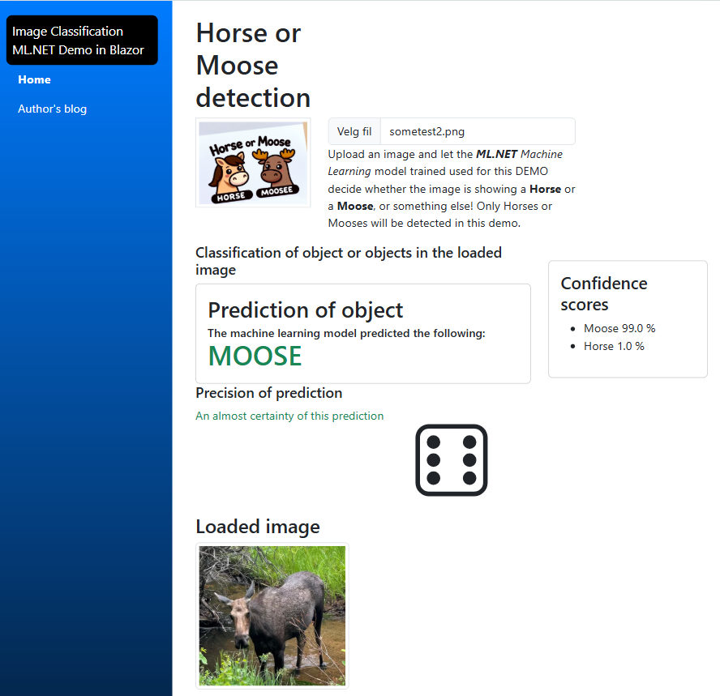
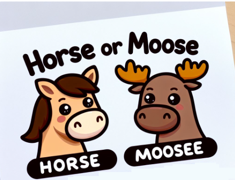

## Image Classification ML.NET Blazor Demo

This demo shows using ML.NET and Image classification to classify images using ML.NET.

The demo machine learning model here detects if the image shows either a horse or a moose.

The machine learning has been trained on a CPU with ten sample images of each category.

## Sample image of this demo 

## App logo

